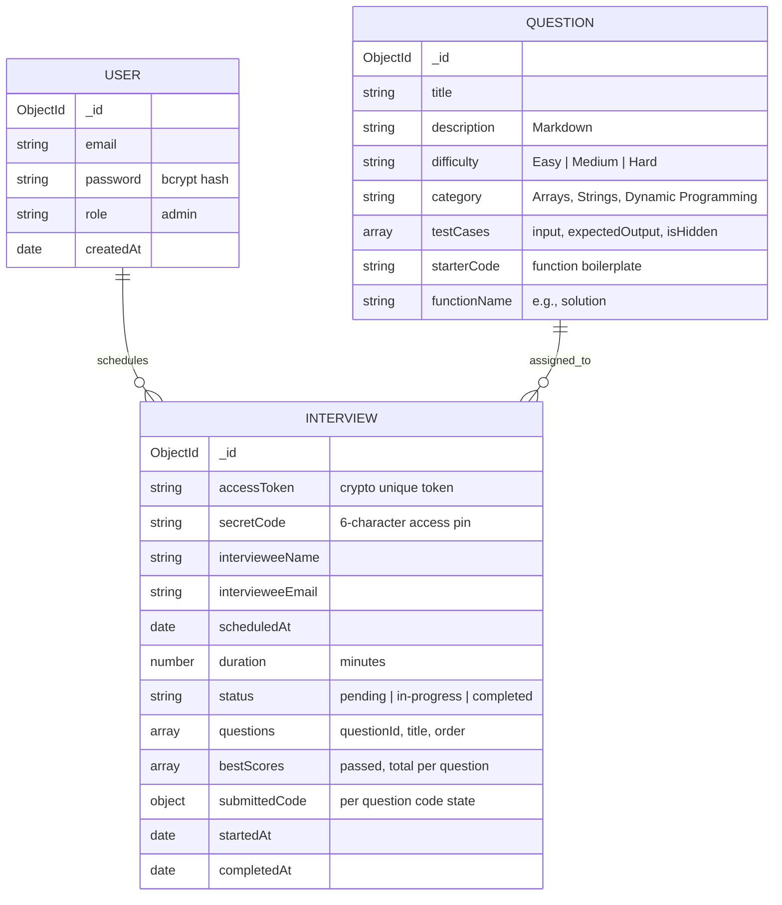
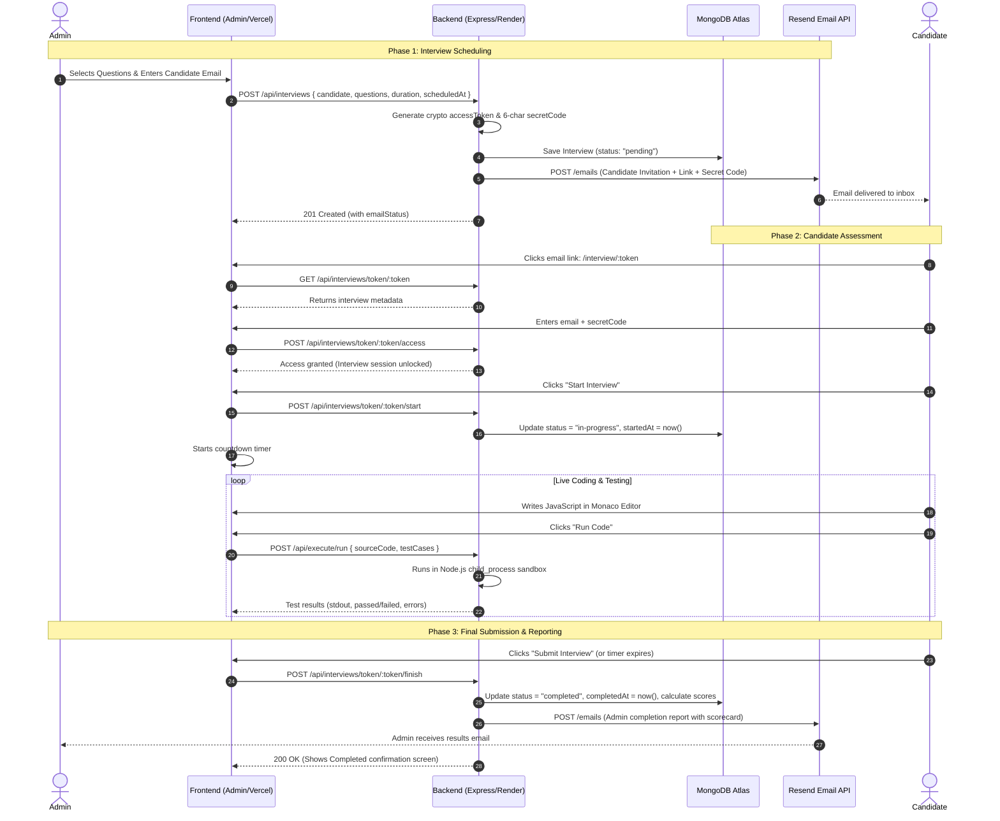

# AI Coding Interview Platform — Architecture & System Design

A comprehensive technical breakdown of how the platform is structured, how data flows between components, and how each subsystem operates.

---

## 1. High-Level System Architecture

The application is built as a decoupled **Client-Server Architecture** with cloud-hosted database, storage, and automated notification services.

```mermaid
graph TB
    subgraph Client_Tier [Client Tier]
        AdminApp["Admin Dashboard (React + Vite)"]
        CandidateApp["Candidate IDE Portal (React + Vite + Monaco)"]
    end

    subgraph CDN_Hosting [Vercel Hosting]
        VercelSPA["Vercel Edge Network (SPA Client Routing)"]
    end

    subgraph API_Tier [Backend Service (Render.com Node.js/Express)]
        APIRouter["Express API Gateway"]
        AuthModule["Auth Route (/api/auth)"]
        QuestionsModule["Question Route (/api/questions)"]
        InterviewModule["Interview Route (/api/interviews)"]
        ExecEngine["Execution Service (/api/execute - Local Sandbox)"]
        EmailService["Email Service (Resend HTTPS API)"]
    end

    subgraph Data_Tier [Persistence & External Services]
        MongoDB[(MongoDB Atlas M0 Cluster)]
        ResendAPI["Resend Cloud API (Port 443)"]
    end

    AdminApp -->|HTTPS / REST| VercelSPA
    CandidateApp -->|HTTPS / REST| VercelSPA
    VercelSPA -->|Proxied REST Calls| APIRouter

    APIRouter --> AuthModule
    APIRouter --> QuestionsModule
    APIRouter --> InterviewModule
    APIRouter --> ExecEngine

    InterviewModule -->|Mongoose ODM| MongoDB
    QuestionsModule -->|Mongoose ODM| MongoDB
    AuthModule -->|Mongoose ODM| MongoDB

    InterviewModule -->|Triggers Email| EmailService
    EmailService -->|HTTPS POST| ResendAPI
    ResendAPI -->|Delivers Email| CandidateEmail["Candidate & Admin Inboxes"]
```

---

## 2. Core Entities & Database Schema

The database is hosted on **MongoDB Atlas** using **Mongoose ODM**. It consists of three primary collections:



---

## 3. End-to-End Interview Lifecycle



---

## 4. Key Subsystem Deep Dives

### A. Code Execution Engine (`backend/src/services/judge0.js` / execute route)
1. **Sandboxing**: When a candidate clicks "Run" or "Submit", the backend creates an isolated child process via Node.js `spawn`.
2. **Wrapper Generation**: The candidate's `solution()` function is wrapped in a test harness that parses JSON test cases, passes input to `solution(input)`, evaluates output against `expectedOutput`, and captures execution stdout.
3. **Execution Guardrails**:
   * **Timeout Enforcement**: If code contains infinite loops (e.g., `while(true)`), execution is automatically terminated after a 5000ms threshold.
   * **Error Containment**: Syntax and runtime errors are captured into `__ERROR__` tokens and returned cleanly to the candidate's output console without crashing the server.

### B. Email Delivery Pipeline (`backend/src/services/email.js`)
* **Transport**: Communicates directly with the **Resend REST API** over **HTTPS (Port 443)**.
* **Why Port 443?**: Cloud providers like Render Free Tier strictly block SMTP ports (25, 465, 587) to prevent spam. Using HTTPS REST APIs allows requests to pass through cloud firewalls reliably.
* **Fallback**: Configured to fall back to Nodemailer (Gmail SMTP) when running in environments where SMTP is permitted.
* **Sanitization**: Automatically sanitizes URLs, strips extraneous `/admin` paths or trailing slashes, and formats email templates.

### C. Frontend Architecture (`frontend/vite-project`)
* **Monaco Editor Integration**: Embedded VS Code editing engine (`@monaco-editor/react`) featuring syntax highlighting, tab indentation, bracket matching, and auto-closing.
* **State Management**:
  * `AuthContext`: Manages JWT admin sessions, login, logout, and token refresh.
  * `InterviewContext`: Manages the admin's interview roster, filtering, and scheduling modal.
  * `QuestionContext`: Manages problem bank CRUD operations.
* **SPA Routing**: Handled by `react-router-dom` with `vercel.json` rewrites (`"source": "/(.*)", "destination": "/"`) to guarantee client-side page reloads never produce 404 errors.

---

## 5. Security & Access Control

1. **Candidate Verification**: Two-factor access barrier — candidates require both the cryptographic URL token (`accessToken`) AND the unique 6-character alphanumeric `secretCode`.
2. **Admin Authorization**: Protected endpoints require a valid `Bearer <JWT_TOKEN>` header signed with the backend's secret key. Passwords are encrypted using salted `bcryptjs` hashes.
3. **Timer Tamper Protection**: The backend records `startedAt` in MongoDB when the candidate begins. Even if a user manipulates their client clock or local storage, the backend checks server timestamps upon submission.

---

## 6. Production Deployment Topology

| Component | Platform | Configuration |
| :--- | :--- | :--- |
| **Frontend** | Vercel | Root: `frontend/vite-project`, Build: `npm run build`, Output: `dist`. Uses `VITE_API_URL`. |
| **Backend** | Render.com | Root: `backend`, Runtime: `Node`, Start: `npm start`. Environment: `MONGODB_URI`, `RESEND_API_KEY`, `FRONTEND_URL`. |
| **Database** | MongoDB Atlas | Free M0 Cluster (`cluster0.r6sjbfy.mongodb.net`), Network IP whitelist `0.0.0.0/0`. |
| **Email API** | Resend | Cloud REST API delivering candidate invitations and admin scorecards. |
