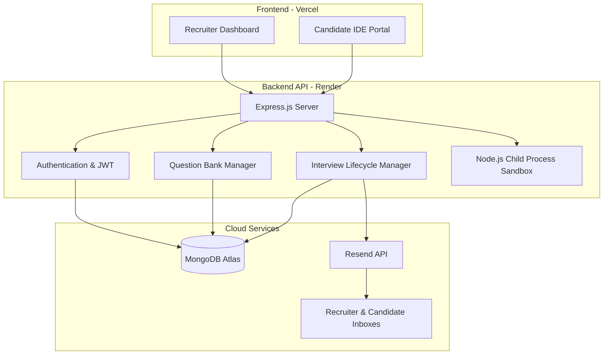
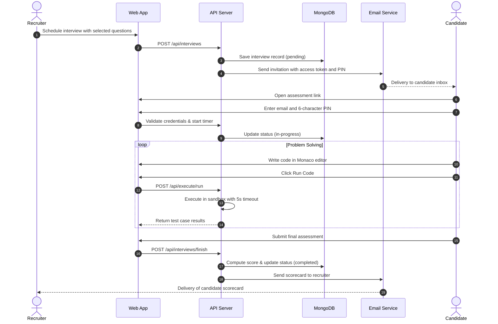

# AI Coding Interview Platform

An automated technical assessment platform for creating coding challenges, scheduling timed interviews, executing JavaScript solutions in an isolated sandbox, and generating candidate scorecards.

---

## Architecture Overview



---

## System Workflow



---

## Core Features

- **Recruiter Dashboard**: Manage question banks, schedule assessments, and review candidate scorecards.
- **In-Browser IDE**: Monaco code editor with syntax highlighting, automatic indentation, and bracket matching.
- **Sandboxed Execution**: Isolated child process runner with a 5-second timeout guard against infinite loops.
- **Two-Factor Access**: Candidate entry protected by a unique URL token and a 6-character access PIN.
- **Automated Email Dispatch**: Interview invitations and completion scorecards sent over HTTPS via Resend.
- **Server Timer Synchronization**: Assessment time enforced via database start timestamps.

---

## Tech Stack

| Layer | Technology |
| :--- | :--- |
| Frontend | React, Vite |
| Code Editor | Monaco Editor (`@monaco-editor/react`) |
| Backend | Node.js, Express |
| Database | MongoDB Atlas (Mongoose) |
| Email Service | Resend REST API |
| Cloud Hosting | Vercel (Frontend), Render (Backend) |

---

## Quick Start

### 1. Backend Setup
```bash
cd backend
npm install
npm run dev
```

### 2. Frontend Setup
```bash
cd frontend/vite-project
npm install
npm run dev
```

Frontend runs on `http://localhost:5173` and backend runs on `http://localhost:5000`.

---

## License

ISC
